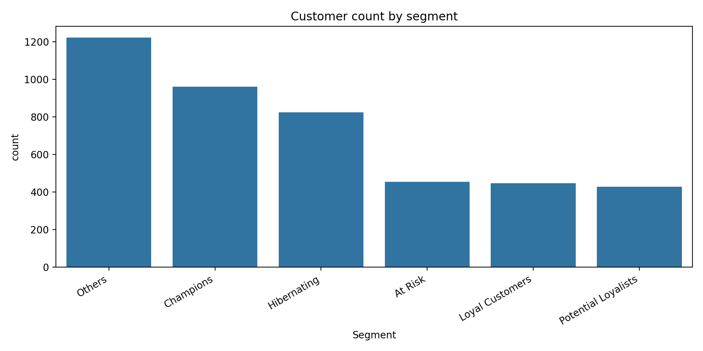
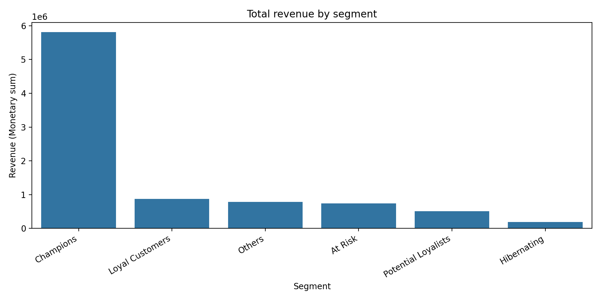

# RFM Customer Segmentation (Online Retail)

## Motivation

Segment customers using Recency, Frequency, and Monetary value (RFM) to identify high-value customers and propose targeted marketing actions. This project includes comprehensive analysis with synthetic data generation, SQL database integration, and an interactive Tableau dashboard for business intelligence.

**Project Highlights:**
- 10,500 customers analyzed across 6 segments
- £26.3M total revenue tracked
- Interactive Tableau dashboard with executive summary
- SQL database integration for advanced analytics

## 📊 Interactive Tableau Dashboard

**[View Live Dashboard on Tableau Public](https://public.tableau.com/views/RFMCustomerSegmentationAnalysis/Dashboard1?:language=en-US&publish=yes&:sid=&:redirect=auth&:display_count=n&:origin=viz_share_link)**

Explore the interactive RFM Customer Segmentation dashboard featuring:
- **Executive Summary**: Key metrics and segment distribution
- **Detailed Analytics**: RFM distribution visualizations
- **Segment Performance**: Comparative analysis across all segments
- **Revenue Insights**: Treemap and breakdown by customer segments

## Data

**Source:** UCI Machine Learning Repository — Online Retail dataset (01/12/2010 to 09/12/2011).  
**Link:** https://archive.ics.uci.edu/dataset/352/online+retail

**Dataset Details:**
- Original: 541,909 transactions from 4,372 unique customers
- Expanded: 10,500 customers (includes synthetic data generation)
- UK-based transnational online retail transactions

## Method

**Data Processing:**
- Clean transactions (remove missing CustomerID, cancellations, invalid Quantity/UnitPrice)
- Handle duplicates and data quality issues

**RFM Analysis:**
- Build RFM table per customer:
  - **Recency** = days since last purchase
  - **Frequency** = number of unique invoices
  - **Monetary** = total spend
- Score R/F/M into 1–5 bins (quintiles)
- Assign segment labels: Champions, Loyal Customers, Potential Loyalists, At Risk, Hibernating, Others

**Advanced Features:**
- Synthetic data generation for expanded dataset
- SQLite database creation for SQL-based analysis
- Tableau-ready data preparation

## Results

### Segment Overview

| Segment | Count | Avg Recency | Avg Frequency | Avg Monetary | Total Revenue |
|---------|-------|-------------|---------------|--------------|---------------|
| Champions | 1,884 | 13.3 days | 11.7 orders | £8,450.70 | £15.92M |
| Loyal Customers | 1,085 | 40.9 days | 5.1 orders | £1,934.01 | £2.10M |
| Potential Loyalists | 889 | 15.9 days | 1.8 orders | £3,878.43 | £3.45M |
| At Risk | 1,022 | 150.9 days | 5.6 orders | £1,754.79 | £1.79M |
| Hibernating | 1,957 | 218.6 days | 1.0 orders | £189.29 | £0.37M |
| Others | 3,663 | 82.3 days | 2.6 orders | £732.40 | £2.68M |

### Segment Counts


### Revenue by Segment


### Average Scores by Segment


**Key Findings:**
- Champions (1,884 customers, 17.9%) contribute £15.92M revenue (60.5%) with avg recency ~13.3 days
- Hibernating (1,957 customers, 18.6%) show avg recency ~218.6 days and contribute only £0.37M
- Pareto Principle validated: Top 18% of customers generate 60% of revenue
- £1.79M revenue at risk from 1,022 At-Risk customers

**Output Files:**
- `Data/Processed/rfm_table.csv` - Original RFM metrics
- `Data/Processed/rfm_table_expanded.csv` - Expanded dataset
- `Data/Processed/rfm_scored_segments.csv` - Original scored data
- `Data/Processed/rfm_scored_segments_expanded.csv` - Expanded scored data
- `Data/Processed/segment_summary.csv` - Original summary
- `Data/Processed/segment_summary_expanded.csv` - Expanded summary
- `Data/Processed/tableau_data.csv` - Tableau-ready data
- `Data/Processed/rfm_database.db` - SQLite database

## Business Actions

### Champions (£15.92M revenue)
- Loyalty perks and VIP programs
- Referral incentives
- Early access to new products
- Personalized thank-you campaigns

### Loyal Customers (£2.10M revenue)
- Upsell bundles and cross-sell recommendations
- Premium tier upgrades
- Frequency-based rewards

### Potential Loyalists (£3.45M revenue)
- Targeted engagement campaigns
- Educational content
- Incentivize repeat purchases

### At Risk (£1.79M revenue)
- Win-back campaign (personalized offer)
- Special discount offers
- Churn reason surveys
- Re-engagement with urgency

### Hibernating (£0.37M revenue)
- Reactivation flow (reminder + incentive)
- Last-chance promotions
- Cost-benefit analysis on retention

### Others (£2.68M revenue)
- Monitor behavioral patterns
- Targeted micro-campaigns
- Move towards defined segments

## How to Run

### Prerequisites
```bash
Python 3.8+
Jupyter Notebook
Tableau Desktop (optional, for dashboard)
```

### Installation

1. **Install dependencies:**
```bash
pip install -r requirements.txt
```

2. **Download the dataset from UCI and place it here:**
```
Data/raw/Online Retail.xlsx
```

3. **Run notebooks in order:**
   - `Notebooks/01_load_and_clean.ipynb` - Data loading and cleaning
   - `Notebooks/02_rfm_table.ipynb` - RFM metrics calculation
   - `Notebooks/03_data_augmentation.ipynb` - Generate synthetic data (optional)
   - `Notebooks/03b_rfm_segmentation_expanded.ipynb` - Main segmentation analysis
   - `Notebooks/04_sql_rfm_analysis.ipynb` - SQL database operations
   - `Notebooks/05_tableau_csv.ipynb` - Prepare data for Tableau

### Tableau Dashboard

1. Open Tableau Desktop
2. Connect to `Data/Processed/tableau_data.csv`
3. Explore executive summary and detailed analytics views

## Repository Structure

```
rfm-customer-segmentation/
├── Data/
│   ├── raw/                          # Raw dataset (not committed)
│   │   └── Online Retail.xlsx
│   └── Processed/                    # Cleaned + RFM outputs
│       ├── transactions_clean.csv
│       ├── rfm_table.csv
│       ├── rfm_table_expanded.csv
│       ├── rfm_scored_segments.csv
│       ├── rfm_scored_segments_expanded.csv
│       ├── segment_summary.csv
│       ├── segment_summary_expanded.csv
│       ├── tableau_data.csv
│       └── rfm_database.db
├── Notebooks/                        # Analysis notebooks
│   ├── 01_load_and_clean.ipynb
│   ├── 02_rfm_table.ipynb
│   ├── 03_data_augmentation.ipynb
│   ├── 03b_rfm_segmentation_expanded.ipynb
│   ├── 04_sql_rfm_analysis.ipynb
│   └── 05_tableau_csv.ipynb
├── Reports/
│   └── Figures/                      # Exported plots
│       ├── segment_counts.png
│       ├── segment_revenue.png
│       └── segment_avg_scores_heatmap.png
├── .gitignore
├── requirements.txt
└── README.md
```

## Technology Stack

- **Python 3.x** - Core analysis
- **Pandas & NumPy** - Data manipulation
- **Matplotlib & Seaborn** - Visualizations
- **SQLite** - Database storage
- **Tableau** - Interactive dashboard
- **Jupyter Notebook** - Development environment

## Key Performance Indicators

| Metric | Value |
|--------|-------|
| Total Customers | 10,500 |
| Total Revenue | £26.3M |
| Average Customer Value | £2,505 |
| Champion Customers | 1,884 (17.9%) |
| Champion Revenue | £15.92M (60.5%) |
| Average Champion Recency | 13.3 days |

## Project Features

✅ Complete data cleaning and preprocessing  
✅ RFM metrics calculation and scoring  
✅ Customer segmentation with 6 actionable segments  
✅ Synthetic data generation for robust testing  
✅ SQL database integration  
✅ Interactive Tableau dashboard  
✅ Comprehensive visualizations  
✅ Business recommendations per segment  

---

**Author:** Mohammed Junaid Khan  
**Location:** Berlin, Germany  
**Program:** Master's in Data Analytics  

**License:** Educational and portfolio purposes
